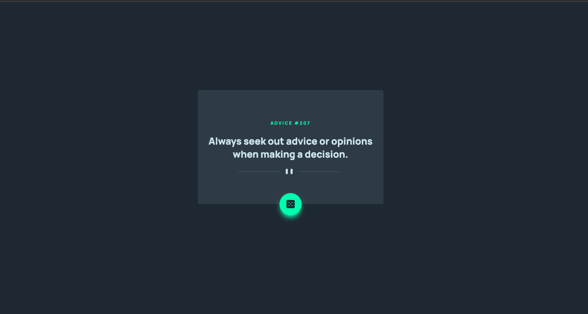
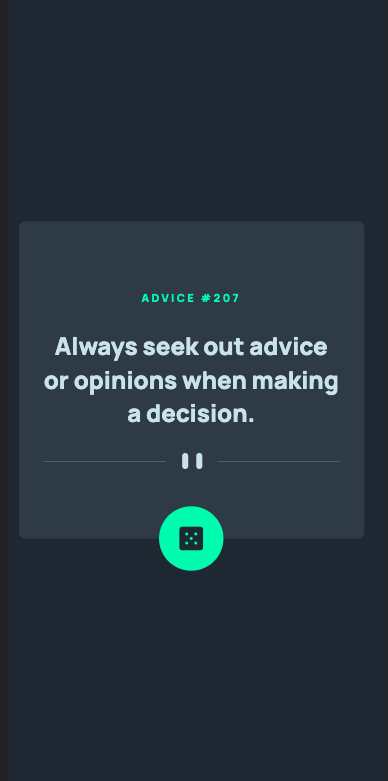

# Frontend Mentor - Advice generator app solution

This is a solution to the [Advice generator app challenge on Frontend Mentor](https://www.frontendmentor.io/challenges/advice-generator-app-QdUG-13db).

## Table of contents

- [Overview](#overview)
  - [The challenge](#the-challenge)
  - [Screenshot](#screenshot)
  - [Links](#links)
- [My process](#my-process)
  - [Built with](#built-with)
  - [What I learned](#what-i-learned)
  - [Continued development](#continued-development)
  - [Useful resources](#useful-resources)
- [Author](#author)
- [Acknowledgments](#acknowledgments)

## Overview

### The challenge

Users should be able to:

- View the optimal layout for the app depending on their device's screen size
- See hover states for all interactive elements on the page
- Generate a new piece of advice by clicking the dice icon

### Screenshot

### Links

- Solution URL: [https://github.com/R3sty/advice-generator-app]
- Live Site URL: [https://r3sty.github.io/advice-generator-app/]

### Built with

- [React](https://reactjs.org/)
- [Vitjs](https://vitejs.dev/)
- [TailwindCSS](https://tailwindcss.com/) - For styles

### What I learned

This project involved building a simple web application that fetches random advice using Axios and displays it on the screen. The application was built using Typescript and TailwindCSS, which allowed for the use of modern syntax and responsive styling.

While building the project, I learned how to use Axios to fetch data from an external API and how to work with Typescript syntax. Additionally, I gained a better understanding of positioning elements on the screen and adding shadows on hover using TailwindCSS.

## Author

- Frontend Mentor - [@R3sty](https://www.frontendmentor.io/profile/R3sty)
- Twitter - [@yourusername](https://twitter.com/R3XIST)
